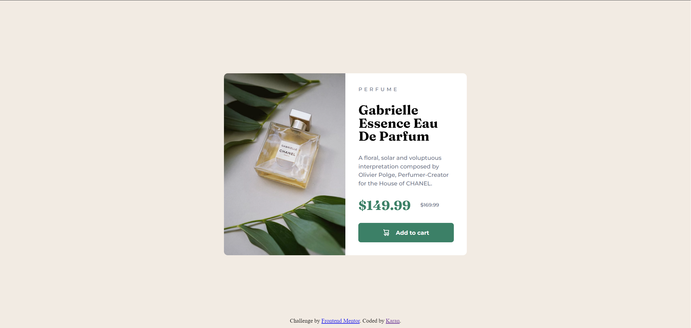

# Frontend Mentor - Product preview card component solution

This is a solution to the [Product preview card component challenge on Frontend Mentor](https://www.frontendmentor.io/challenges/product-preview-card-component-GO7UmttRfa). Frontend Mentor challenges help you improve your coding skills by building realistic projects.

## Table of contents

- [Overview](#overview)
  - [Screenshot](#screenshot)
  - [Links](#links)
- [My process](#my-process)
  - [Built with](#built-with)
  - [What I learned](#what-i-learned)
- [Author](#author)

## Overview

I coded this solution for the Frontend Mentor Product preview card component challenge. Here, _I made the preview card with given color pallete using HTML5, CSS3 and concepts of Flexbox plus media query_. I tried to be exact to the design, so do check it out and feel free to leave any suggestion and improvements.

### Screenshot

  
  
Desktop View

 

  
  
Destop View: Active State

 

  
  
Mobile View

### Links

- Solution URL: [Add solution URL here](https://your-solution-url.com)
- Live Site URL: [Add live site URL here](https://your-live-site-url.com)

## My process

This was a little tough and challenging for me but I made it work using Flexbox as I wanted to learn its concept through this project. This is how I went for this:

- First, I made the basic structure and gave background color and color.
- Next, I made wrapper class to enclose my card and centered it using flex. I did the same inside the wrapper too. (You could do it with grid too) .
- Then, I applied the flexbox concept in the Product Details div too to properly align the sub-texts.
- In the end, it was trial and error to decide the font-size, margins, padding, line-spacing etc.

### Built with

- Semantic HTML5 markup
- CSS custom properties
- Flexbox
- Media Queries

### What I learned

I learned a lot lot through this project. I decided to learn **Flexbox** by implementing its concepts in this project and you can clearly see in the code that I have extensively used flexbox in this.
I also learned how **Media Queries** work by adding few modifications in the code for mobile view under it. But One thing I could have definitely improved upon would be **Mobile-First Approach** which I would try apply apply in some next project.

## Author

- LinkedIn - [Karan](https://www.linkedin.com/in/karan-2841a919a)
- Frontend Mentor - [@karancy021](https://www.frontendmentor.io/profile/karancy021)
- Twitter - [@Krat0sum](https://twitter.com/Krat0sum)
